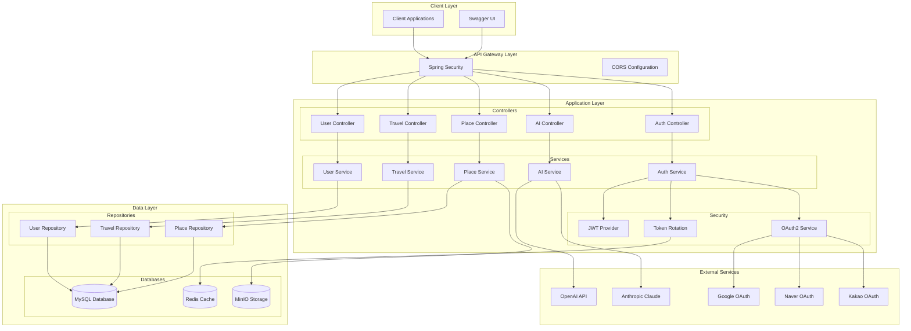
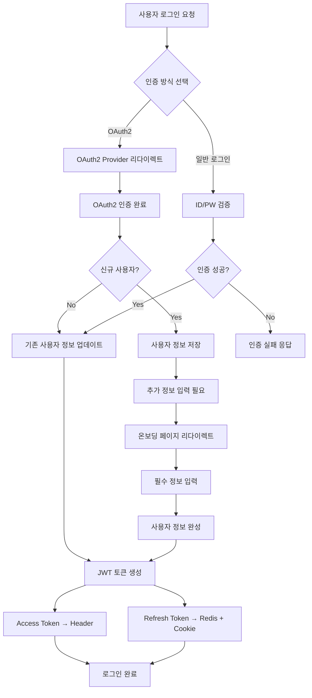
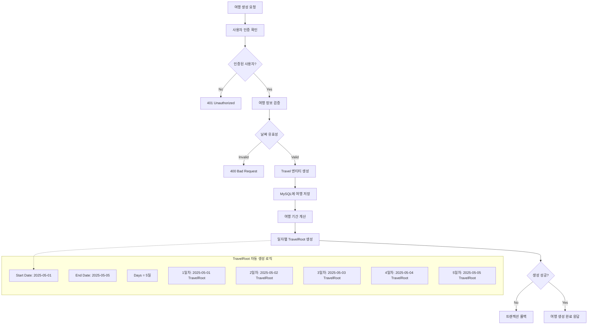
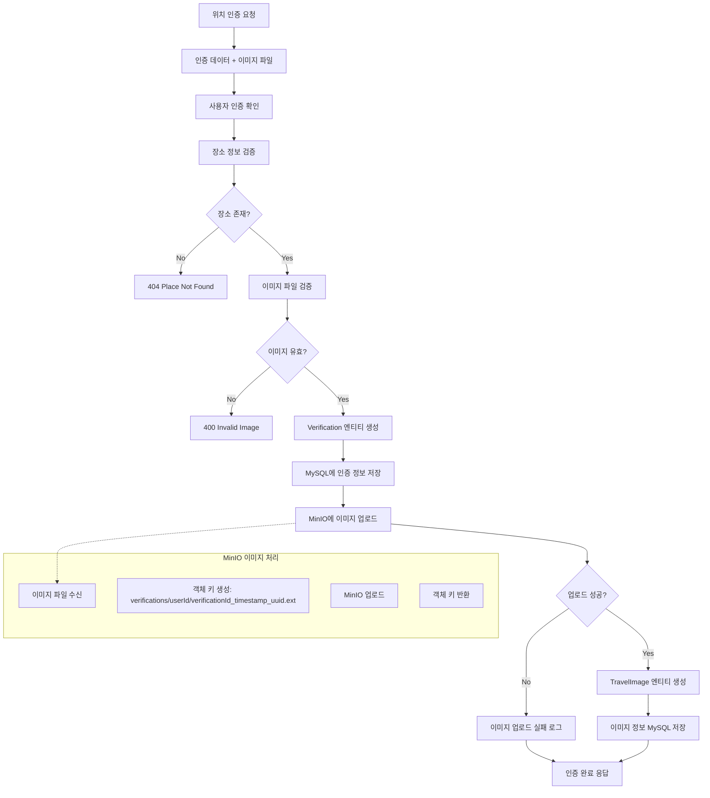
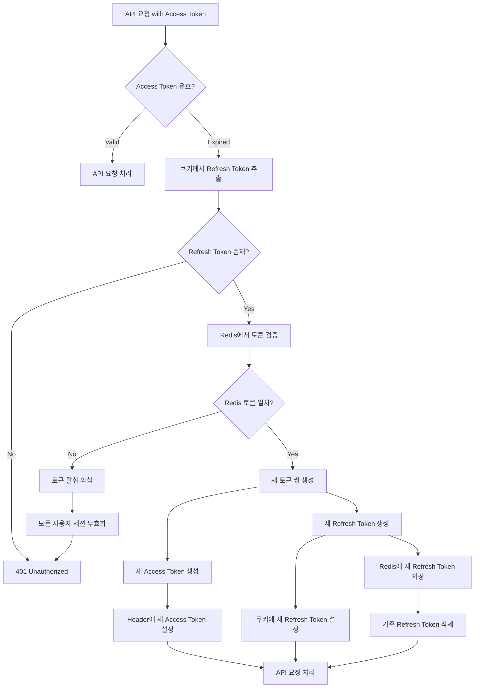

# LOG-O SpringAI 프로젝트

## 📖 프로젝트 개요

LOG-O는 **여행 일정 관리 및 AI 통합 서비스**를 제공하는 Spring Boot 기반의 백엔드 API 서버입니다. 사용자들이 여행 계획을 세우고, 위치를 인증하며, AI 챗봇과 상호작용할 수 있는 종합적인 여행 플랫폼을 목표로 합니다.

### 🎯 주요 기능
- **사용자 인증**: OAuth2.0 (Google, Naver, Kakao) 및 자체 로그인
- **여행 관리**: 여행 계획 생성, 루트 관리, 일정 관리
- **위치 인증**: GPS 기반 장소 방문 인증 시스템
- **AI 챗봇**: OpenAI GPT 및 Anthropic Claude 통합
- **이미지 관리**: MinIO를 통한 안전한 이미지 저장
- **소셜 기능**: 장소 좋아요, 리뷰 작성

## 🏗️ 시스템 아키텍처



## 🔧 기술 스택 및 선택 이유

### 🖥️ Backend Framework
| 기술 | 버전 | 선택 이유 | 이점 |
|------|------|-----------|------|
| **Spring Boot** | 3.4.0 | • 빠른 개발 환경 구축<br>• 자동 설정 및 내장 서버<br>• 풍부한 생태계 | • 개발 생산성 향상<br>• 유지보수성 개선<br>• 확장성 확보 |
| **Spring Security** | 6.x | • 검증된 보안 프레임워크<br>• OAuth2 지원<br>• JWT 통합 | • 보안 취약점 최소화<br>• 표준 보안 구현<br>• 다양한 인증 방식 지원 |
| **Spring AI** | 1.0.0-M8 | • AI 서비스 통합 간소화<br>• 다중 AI 모델 지원<br>• Spring 생태계 통합 | • AI 통합 개발 시간 단축<br>• 일관된 AI 인터페이스<br>• 확장 가능한 AI 아키텍처 |

### 🗄️ Database & Storage
| 기술 | 선택 이유 | 이점 |
|------|-----------|------|
| **MySQL 8.0** | • 안정적인 관계형 DB<br>• 복잡한 관계 데이터 처리<br>• 트랜잭션 보장 | • 데이터 무결성 보장<br>• 복잡한 쿼리 최적화<br>• 대용량 데이터 처리 |
| **Redis 7.0** | • 인메모리 캐시<br>• 빠른 토큰 검증<br>• TTL 자동 관리 | • 토큰 보안성 향상<br>• 응답 속도 개선<br>• 자동 만료 처리 |
| **MinIO** | • S3 호환 로컬 스토리지<br>• 비용 효율적<br>• 개발 환경 적합 | • 이미지 저장 비용 절약<br>• 로컬 개발 환경 구축<br>• Presigned URL 보안 |

### 🔒 Security & Authentication
| 기술 | 구현 방식 | 보안 이점 |
|------|----------|----------|
| **JWT Token** | • Access Token (Header)<br>• Refresh Token (Cookie)<br>• RTR 방식 적용 | • 토큰 탈취 위험 최소화<br>• 자동 토큰 순환<br>• 보안성과 편의성 균형 |
| **OAuth2.0** | • Google, Naver, Kakao<br>• 사용자 정보 최소 수집<br>• 표준 프로토콜 준수 | • 사용자 편의성 증대<br>• 개인정보 보호<br>• 신뢰성 있는 인증 |

## 🔄 핵심 비즈니스 로직 Flow Chart

### 1. 사용자 인증 플로우



### 2. 여행 계획 생성 플로우



### 3. 위치 인증 플로우



### 4. JWT 토큰 순환 (RTR) 플로우



## 🎯 Use Case Diagram

```mermaid
graph TB
    subgraph "사용자 (User)"
        U1[일반 사용자]
        U2[OAuth2 사용자]
        U3[관리자]
    end
    
    subgraph "인증 관련 (Authentication)"
        UC1[회원가입]
        UC2[로그인]
        UC3[OAuth2 로그인]
        UC4[토큰 갱신]
        UC5[로그아웃]
        UC6[프로필 수정]
    end
    
    subgraph "여행 관리 (Travel Management)"
        UC7[여행 계획 생성]
        UC8[여행 정보 수정]
        UC9[여행 루트 관리]
        UC10[여행 지역 추가]
        UC11[여행 결제 내역 관리]
        UC12[여행 삭제]
    end
    
    subgraph "위치 및 장소 (Location & Place)"
        UC13[장소 검색]
        UC14[장소 상세 조회]
        UC15[위치 인증]
        UC16[장소 좋아요]
        UC17[리뷰 작성]
    end
    
    subgraph "AI 서비스 (AI Service)"
        UC18[ChatGPT 대화]
        UC19[Claude 대화]
    end
    
    subgraph "이미지 관리 (Image Management)"
        UC20[이미지 업로드]
        UC21[이미지 조회]
        UC22[이미지 URL 생성]
    end
    
    %% 사용자별 권한 관계
    U1 --> UC1
    U1 --> UC2
    U1 --> UC6
    U1 --> UC7
    U1 --> UC8
    U1 --> UC9
    U1 --> UC10
    U1 --> UC11
    U1 --> UC12
    U1 --> UC13
    U1 --> UC14
    U1 --> UC15
    U1 --> UC16
    U1 --> UC17
    U1 --> UC18
    U1 --> UC19
    U1 --> UC20
    U1 --> UC21
    U1 --> UC22
    
    U2 --> UC3
    U2 --> UC6
    U2 --> UC7
    U2 --> UC8
    U2 --> UC9
    U2 --> UC10
    U2 --> UC11
    U2 --> UC12
    U2 --> UC13
    U2 --> UC14
    U2 --> UC15
    U2 --> UC16
    U2 --> UC17
    U2 --> UC18
    U2 --> UC19
    U2 --> UC20
    U2 --> UC21
    U2 --> UC22
    
    U3 --> UC1
    U3 --> UC2
    U3 --> UC6
    U3 --> UC7
    U3 --> UC8
    U3 --> UC9
    U3 --> UC10
    U3 --> UC11
    U3 --> UC12
    U3 --> UC13
    U3 --> UC14
    U3 --> UC15
    U3 --> UC16
    U3 --> UC17
    U3 --> UC18
    U3 --> UC19
    U3 --> UC20
    U3 --> UC21
    U3 --> UC22
    
    %% 공통 인증 관련
    UC2 --> UC4
    UC3 --> UC4
    UC4 --> UC5
```



## 📋 핵심 비즈니스 로직 상세 설명

### 1. 🔐 JWT 토큰 관리 시스템

#### RTR (Refresh Token Rotation) 구현
```java
public boolean rotateTokens(HttpServletRequest request, HttpServletResponse response) {
    // 1. 쿠키에서 Refresh Token 추출
    String refreshToken = cookieProvider.getRefreshTokenFromCookies(request);
    
    // 2. 토큰 유효성 검증
    if (refreshToken == null || !jwtTokenProvider.validateToken(refreshToken)) {
        return false;
    }
    
    // 3. Redis에 저장된 토큰과 비교
    String storedToken = tokenStore.getRefreshToken(userId);
    if (!storedToken.equals(refreshToken)) {
        // 4. 토큰 불일치 시 모든 세션 무효화 (보안 조치)
        tokenStore.invalidateAllUserSessions(userId);
        return false;
    }
    
    // 5. 새 토큰 쌍 생성 및 교체
    String newAccessToken = jwtTokenProvider.createAccessToken(authentication);
    String newRefreshToken = jwtTokenProvider.createRefreshToken(authentication);
    
    return true;
}
```

**보안 특징:**
- **토큰 탈취 감지**: Refresh Token 불일치 시 모든 세션 무효화
- **자동 순환**: 토큰 사용 시마다 새로운 토큰 쌍 생성
- **분리 저장**: Access Token(Header) + Refresh Token(Cookie)

### 2. 🗺️ 여행 계획 자동 생성 시스템

#### 일자별 TravelRoot 자동 생성
```java
private void createTravelRootsForTravelPeriod(Travel travel) {
    LocalDate startDate = travel.getStartDate();
    LocalDate endDate = travel.getEndDate();
    
    // 여행 기간 계산 (시작일과 종료일 포함)
    long daysBetween = ChronoUnit.DAYS.between(startDate, endDate) + 1;
    
    List<TravelRoot> travelRoots = new ArrayList<>();
    
    // 각 날짜별로 TravelRoot 생성
    for (int dayIndex = 0; dayIndex < daysBetween; dayIndex++) {
        LocalDate currentDate = startDate.plusDays(dayIndex);
        int dayNumber = dayIndex + 1;
        
        TravelRoot travelRoot = TravelRoot.builder()
                .travel(travel)
                .day(dayNumber)
                .travelDate(currentDate)
                .build();
        
        travelRoots.add(travelRoot);
    }
    
    travelRootRepository.saveAll(travelRoots);
}
```

**비즈니스 로직:**
- **자동 일정 생성**: 여행 기간에 따라 자동으로 일자별 루트 생성
- **날짜 계산**: 시작일과 종료일을 포함한 정확한 기간 계산
- **일괄 처리**: 모든 루트를 한 번에 생성하여 성능 최적화

### 3. 📍 위치 인증 시스템

#### 이미지와 함께하는 위치 인증
```java
@Transactional
public VerificationDto addVerificationWithImage(VerificationRequestDto requestDto, MultipartFile imageFile) {
    // 1. 사용자 및 장소 검증
    User user = getCurrentUser();
    Place place = validatePlace(requestDto.getPid());
    
    // 2. 인증 정보 생성
    Verification verification = Verification.builder()
            .user(user)
            .place(place)
            .star(requestDto.getStar())
            .review(requestDto.getReview())
            .build();
    
    Verification savedVerification = verificationRepository.save(verification);
    
    // 3. 이미지 MinIO 업로드
    if (imageFile != null && !imageFile.isEmpty()) {
        String objectKey = minIOService.uploadVerificationImage(
                imageFile, user.getUuid(), savedVerification.getVuid()
        );
        
        // 4. TravelImage 엔티티 생성
        TravelImage travelImage = TravelImage.builder()
                .user(user)
                .verification(savedVerification)
                .travel(findRelatedTravel(place, user))
                .name("방문 인증 이미지 - " + place.getName())
                .url(objectKey)
                .build();
        
        travelImageRepository.save(travelImage);
    }
    
    return VerificationDto.fromEntity(savedVerification);
}
```

**핵심 특징:**
- **이미지 증명**: 실제 방문을 증명하는 이미지 업로드 필수
- **MinIO 통합**: 안전한 이미지 저장 및 Presigned URL 생성
- **자동 연결**: 사용자의 여행 일정과 자동 연결

### 4. 🤖 AI 챗봇 시스템

#### 다중 AI 모델 지원
```java
@Service
public class AIService {
    private final ChatClient openAiChatClient;
    private final ChatClient anthropicChatClient;
    
    public ChatResponse chatWithOpenAi(ChatRequest chatRequest) {
        String answer = openAiChatClient
                .prompt()
                .user(chatRequest.getQuestion())
                .advisors(advisorSpec -> 
                    advisorSpec.param("chat_memory_conversation_id", chatId))
                .call()
                .content();
        
        return new ChatResponse(chatId, answer);
    }
    
    public ChatResponse chatWithAnthropic(ChatRequest chatRequest) {
        // Claude 모델과의 대화 처리
        return anthropicChatClient.prompt()...
    }
}
```

**AI 통합 특징:**
- **다중 모델**: OpenAI GPT와 Anthropic Claude 동시 지원
- **대화 메모리**: 세션별 대화 기록 유지
- **캐릭터 설정**: "Detective Sherlock Bones" 캐릭터 적용

### 5. 🖼️ 이미지 관리 시스템

#### MinIO와 Presigned URL
```java
public String generatePresignedUrl(String objectKey, int expiryMinutes) {
    try {
        String presignedUrl = minioClient.getPresignedObjectUrl(
                GetPresignedObjectUrlArgs.builder()
                        .method(Method.GET)
                        .bucket(bucketName)
                        .object(objectKey)
                        .expiry(expiryMinutes, TimeUnit.MINUTES)
                        .build()
        );
        
        return presignedUrl;
    } catch (Exception e) {
        throw new RuntimeException("이미지 URL 생성 중 오류가 발생했습니다: " + e.getMessage(), e);
    }
}
```

**보안 및 성능 특징:**
- **임시 URL**: 지정된 시간 후 자동 만료
- **직접 접근 차단**: MinIO 스토리지 직접 접근 불가
- **비용 효율성**: 로컬 스토리지로 S3 대비 비용 절약

## 🚀 개발 환경 설정

### Prerequisites
- Java 21+
- Docker & Docker Compose
- MySQL 8.0+
- Redis 7.0+
- MinIO

### 환경 변수 설정
```bash
# Database
DB_URL=jdbc:mysql://localhost:3307/loggodb
DB_USER=root
DB_PASSWORD=root

# JWT
JWT_SECRET=your-jwt-secret-key

# AI APIs
OPENAI_API_KEY=your-openai-api-key
ANTHROPIC_API_KEY=your-anthropic-api-key
GPT_MODEL=gpt-4
CLAUDE_MODEL=claude-3-sonnet-20240229

# OAuth2
GOOGLE_CLIENT_ID=your-google-client-id
GOOGLE_CLIENT_SECRET=your-google-client-secret
NAVER_CLIENT_ID=your-naver-client-id
NAVER_CLIENT_SECRET=your-naver-client-secret
KAKAO_CLIENT_ID=your-kakao-client-id
KAKAO_CLIENT_SECRET=your-kakao-client-secret

# MinIO
MINIO_ACCESS_KEY=banchan
MINIO_SECRET_KEY=banchandev
MINIO_BUCKET_NAME=travel-images

# Application
APP_DOMAIN=localhost
```

### Docker 컨테이너 실행
```bash
# Docker Compose로 데이터베이스 서비스 시작
cd src/main/resources
docker-compose up -d

# 서비스 상태 확인
docker-compose ps
```

### 애플리케이션 실행
```bash
# Gradle을 통한 실행
./gradlew bootRun

# 또는 JAR 파일 실행
./gradlew build
java -jar build/libs/logo-server-0.0.1-SNAPSHOT.jar
```

## 📊 API 문서

### Swagger UI 접근
- **URL**: http://localhost:8080/swagger-ui.html
- **API Docs**: http://localhost:8080/v3/api-docs

### 주요 API 엔드포인트

#### 🔐 인증 관련
```http
POST /api/auth/signup          # 회원가입
POST /api/auth/login           # 로그인
POST /api/auth/refresh         # 토큰 갱신
POST /api/auth/logout          # 로그아웃
GET  /api/auth/me              # 내 정보 조회
```

#### 🗺️ 여행 관리
```http
GET    /api/travels            # 여행 목록 조회
POST   /api/travels            # 여행 생성
GET    /api/travels/{id}       # 여행 상세 조회
PUT    /api/travels/{id}       # 여행 정보 수정
DELETE /api/travels/{id}       # 여행 삭제
```

#### 📍 위치 인증
```http
POST /api/verifications/verify # 위치 인증 (이미지 포함)
GET  /api/verifications        # 인증 목록 조회
```

#### 🤖 AI 챗봇
```http
POST /api/chat/openai          # OpenAI 챗봇
POST /api/chat/anthropic       # Anthropic 챗봇
```

## 🧪 테스트

### 테스트 전략
1. **Postman Collection**: API 통합 테스트
2. **Swagger UI**: 실시간 API 테스트
3. **Unit Tests**: 비즈니스 로직 단위 테스트

### 테스트 실행
```bash
# 전체 테스트 실행
./gradlew test

# 특정 테스트 클래스 실행
./gradlew test --tests "UserServiceTest"
```

## 📈 성능 최적화

### 1. Database 최적화
- **FetchJoin 사용**: N+1 쿼리 문제 해결
- **인덱싱**: 자주 조회되는 컬럼에 인덱스 적용
- **Connection Pool**: HikariCP 사용

### 2. 캐싱 전략
- **Redis**: JWT 토큰 캐싱
- **MinIO**: 이미지 CDN 역할

### 3. 보안 최적화
- **CORS 설정**: 허용된 도메인만 접근
- **CSRF 보호**: Spring Security 기본 보호
- **SQL Injection 방지**: JPA Prepared Statement

## 🔧 모니터링 및 로깅

### 로깅 설정
```yaml
logging:
  level:
    com.ssafy.logoserver: DEBUG
    org.hibernate.SQL: DEBUG
    org.hibernate.type.descriptor.sql.BasicBinder: TRACE
```

### 헬스 체크
```http
GET /health  # 서버 상태 확인
```

## 🤝 기여 가이드

### 코드 스타일
- **Java 21** 문법 준수
- **Spring Boot Convention** 따름
- **RESTful API** 설계 원칙 준수

### 브랜치 전략
```
main     : 배포 준비 완료된 코드
develop  : 개발 중인 코드
feature/ : 새로운 기능 개발
hotfix/  : 긴급 버그 수정
```

## 👨‍💻 개발자 정보

- **개발 인원**: 박병찬(팀장, FrontEnd, EslasticStack 및 AI 담당), 한승수(BackEnd, DB 및 인프라 구축 담당)
- **Connect**: qudcks8084@gmail.com, h2sorginal@gmail.com


|                                                          **박병찬**                                                          |                                                          **한승수**                                                          |
| :--------------------------------------------------------------------------------------------------------------------------: | :--------------------------------------------------------------------------------------------------------------------------: |
| [ <br/> @SIDEDISH](https://github.com/qudcks8084) | [ <br/> @SEUNGSU-HAN](https://github.com/SEUNGSU-HAN) |
|                                                       FE │ ES │ AI                                                        |                                                       BE │ DB │ INFRA                                                        |


---

**LOG-O 프로젝트** - 여행의 모든 순간을 기록하고 공유하는 스마트한 여행 플랫폼 🌍
