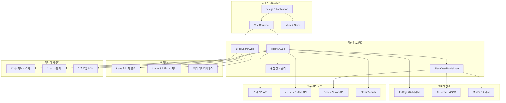
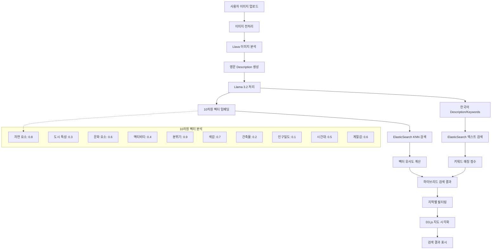
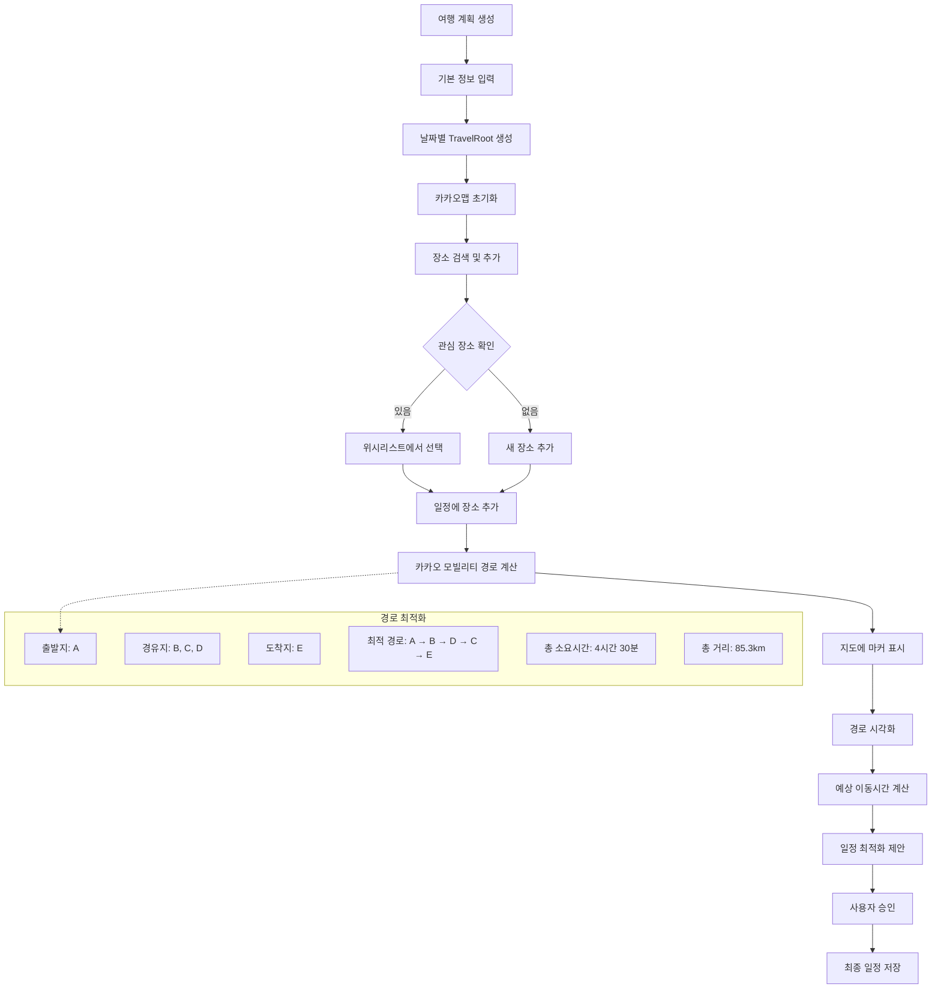

# LOG:O Vue.js 프론트엔드 프로젝트

## 📖 프로젝트 개요

LOG:O는 **AI 기반 멀티모달 여행 검색 엔진 및 자동 가계부 서비스**를 제공하는 Vue.js 기반의 프론트엔드 애플리케이션입니다. 사용자들이 감정과 분위기를 기반으로 여행지를 검색하고, 여행 계획을 세우며, 실제 방문을 인증할 수 있는 혁신적인 여행 플랫폼입니다.

### 🎯 주요 기능
- **멀티모달 검색**: 이미지, 키워드, 감정 기반 여행지 검색
- **AI 기반 이미지 분석**: Llava와 Llama 3.2를 활용한 10차원 여행지 특성 분석
- **여행 계획 관리**: 일정별 장소 관리, 경로 계산, 예산 추적
- **방문 인증 시스템**: GPS 기반 실제 방문 인증 및 이미지 업로드
- **자동 영수증 인식**: Google Vision API와 OCR을 활용한 자동 지출 입력
- **관심 장소 관리**: 위시리스트 기능으로 개인화된 여행 계획

## 🏗️ 시스템 아키텍처



## 🔧 기술 스택 및 선택 이유

### 🖥️ Frontend Framework
| 기술 | 버전 | 선택 이유 | 이점 |
|------|------|-----------|------|
| **Vue.js** | 3.x | • 컴포넌트 기반 아키텍처<br>• Composition API 지원<br>• 빠른 개발 속도 | • 재사용 가능한 컴포넌트<br>• 반응형 데이터 바인딩<br>• 작은 번들 크기 |
| **Vue Router** | 4.x | • SPA 라우팅 관리<br>• 코드 스플리팅<br>• 네비게이션 가드 | • SEO 최적화<br>• 페이지 전환 최적화<br>• 중첩 라우팅 지원 |
| **Vuex** | 4.x | • 중앙 집중식 상태 관리<br>• 컴포넌트 간 데이터 공유<br>• 개발 도구 지원 | • 예측 가능한 상태 변경<br>• 디버깅 편의성<br>• 모듈화된 스토어 |

### 🎨 UI/UX 및 스타일링
| 기술 | 선택 이유 | 이점 |
|------|-----------|------|
| **SCSS/Sass** | • 중첩 규칙 및 변수 지원<br>• 믹스인과 함수 활용<br>• 모듈화된 스타일 관리 | • 유지보수성 향상<br>• 코드 재사용성<br>• 일관된 디자인 시스템 |
| **CSS Modules** | • 스타일 캡슐화<br>• 클래스명 충돌 방지<br>• 컴포넌트별 스타일 격리 | • 스타일 충돌 제거<br>• 코드 가독성 향상<br>• 유지보수 편의성 |
| **Responsive Design** | • 모바일 우선 설계<br>• 다양한 화면 크기 지원<br>• PWA 호환성 | • 크로스 플랫폼 지원<br>• 사용자 경험 향상<br>• 접근성 개선 |

### 📊 데이터 시각화 및 지도
| 기술 | 구현 방식 | 활용 목적 |
|------|----------|----------|
| **D3.js** | • SVG 기반 인터랙티브 지도<br>• 지역별 필터링 UI<br>• 커스텀 시각화 | • 직관적인 지역 선택<br>• 데이터 시각화<br>• 사용자 인터랙션 |
| **Chart.js** | • 여행 통계 차트<br>• 지출 분석 그래프<br>• 방문 트렌드 시각화 | • 데이터 인사이트 제공<br>• 시각적 피드백<br>• 성과 추적 |
| **카카오맵 SDK** | • 지도 표시 및 마커<br>• 경로 계산 및 시각화<br>• 장소 검색 통합 | • 정확한 위치 정보<br>• 실시간 경로 안내<br>• 한국 지역 특화 |

### 🤖 AI 및 이미지 처리
| 기술 | 처리 방식 | 핵심 기능 |
|------|----------|----------|
| **Llava** | • 이미지 → 영문 Description<br>• 시각적 특성 추출<br>• 감정 키워드 분석 | • 이미지 기반 검색<br>• 분위기 분석<br>• 유사도 계산 |
| **Llama 3.2** | • 10차원 벡터 임베딩<br>• 한국어 Description 생성<br>• Keywords 추출 | • 벡터 검색 최적화<br>• 다국어 지원<br>• 의미론적 검색 |
| **ElasticSearch** | • KNN 벡터 검색<br>• 텍스트 키워드 검색<br>• 하이브리드 검색 | • 빠른 검색 응답<br>• 정확도 향상<br>• 확장성 확보 |

### 📱 이미지 및 위치 처리
| 기술 | 구현 내용 | 보안 및 성능 |
|------|----------|-------------|
| **EXIF-js** | • GPS 좌표 추출<br>• 촬영 시간 확인<br>• 카메라 정보 분석 | • 실제 방문 인증<br>• 위치 정확도 검증<br>• 메타데이터 보안 |
| **Tesseract.js** | • 영수증 OCR 처리<br>• 텍스트 추출 및 분석<br>• 자동 지출 입력 | • 로컬 처리로 보안성<br>• 실시간 텍스트 인식<br>• 비용 효율성 |
| **Google Vision API** | • 고급 OCR 처리<br>• 한국어 텍스트 인식<br>• 영수증 구조 분석 | • 높은 인식 정확도<br>• 다양한 형식 지원<br>• 클라우드 처리 |

## 🔄 핵심 비즈니스 로직 Flow Chart

### 1. 멀티모달 여행지 검색 플로우



### 2. 여행 계획 관리 플로우



## 🎯 핵심 컴포넌트 상세 설명

### 1. 🗺️ TripPlan.vue - 여행 계획 관리

#### 주요 기능 구현
```javascript
// 관심 장소 판별 로직
const isInWishlist = (place) => {
  return wishlistPlaces.value.some(p => 
    p.address_name === (place.address_name || place.road_address_name)
  );
};

// 카카오 모빌리티 API 경로 계산
const calculateOptimalRoute = async (waypoints) => {
  const response = await kakaoMobilityAPI.calculateRoute({
    origin: waypoints[0],
    destination: waypoints[waypoints.length - 1],
    waypoints: waypoints.slice(1, -1),
    priority: 'RECOMMEND' // 추천 경로
  });
  
  return {
    duration: response.duration,
    distance: response.distance,
    routes: response.routes
  };
};
```

**핵심 특징:**
- **카카오맵 SDK 통합**: 지도 표시, 마커 관리, 경로 시각화
- **다중 경유지 경로**: 최적화된 여행 동선 계산
- **실시간 위치 추적**: GPS 기반 현재 위치 확인
- **지출 관리**: 카테고리별 예산 추적 및 통계

### 2. 🔍 LogoSearch.vue - AI 기반 검색

#### 이미지 분석 및 검색 로직
```javascript
// 이미지 분석 파이프라인
const analyzeImage = async (imageFile) => {
  // 1. Llava로 이미지 → 영문 Description
  const description = await llavaAPI.analyzeImage(imageFile);
  
  // 2. Llama 3.2로 벡터 임베딩
  const vectorEmbedding = await llamaAPI.createEmbedding(description);
  
  // 3. 한국어 변환 및 키워드 추출
  const koreanData = await llamaAPI.translateAndExtract(description);
  
  return {
    description,
    vector: vectorEmbedding,
    korean: koreanData.description,
    keywords: koreanData.keywords
  };
};

// ElasticSearch 하이브리드 검색
const searchSimilarPlaces = async (analysisResult) => {
  const vectorSearch = await elasticAPI.knnSearch({
    vector: analysisResult.vector,
    k: 50
  });
  
  const keywordSearch = await elasticAPI.textSearch({
    query: analysisResult.keywords.join(' ')
  });
  
  // 하이브리드 스코어링
  return combineSearchResults(vectorSearch, keywordSearch);
};
```

**혁신적 특징:**
- **10차원 벡터 분석**: 자연, 도시, 문화, 분위기 등 세부 특성 분석
- **감정 기반 검색**: "로맨틱한", "힐링되는" 등 감정 키워드 검색
- **지역별 필터링**: D3.js 인터랙티브 지도로 직관적 필터링

### 3. 📱 관심 장소 관리 시스템

#### 중앙화된 위시리스트 관리
```javascript
// Vuex Store - 위시리스트 모듈
export default {
  state: () => ({
    items: [],
    isLoading: false
  }),
  
  getters: {
    isInWishlist: (state) => (place) => {
      return state.items.some(item => 
        item.place?.address === place.address &&
        item.place?.name === place.name
      );
    },
    
    wishlistByRegion: (state) => (regionCode) => {
      return state.items.filter(item => 
        item.place?.region === regionCode
      );
    }
  },
  
  mutations: {
    SET_WISHLIST(state, items) {
      state.items = items.map(normalizeWishlistItem);
    },
    
    ADD_WISHLIST_ITEM(state, item) {
      if (!state.items.find(i => i.place?.address === item.place?.address)) {
        state.items.push(normalizeWishlistItem(item));
      }
    },
    
    REMOVE_WISHLIST_ITEM(state, address) {
      const index = state.items.findIndex(i => 
        i.place?.address === address
      );
      if (index !== -1) {
        state.items.splice(index, 1);
      }
    }
  },
  
  actions: {
    async toggleWishlist({ commit, getters }, place) {
      if (getters.isInWishlist(place)) {
        await removeUserLikeByAddress(place.address);
        commit('REMOVE_WISHLIST_ITEM', place.address);
      } else {
        const response = await addUserLike(place);
        if (response.status === 'success') {
          commit('SET_WISHLIST', response.data);
        }
      }
    }
  }
};
```

## 🚀 개발 환경 설정

### Prerequisites
- Node.js 18+
- npm 또는 yarn
- Vue CLI 5+

### 환경 변수 설정
```bash
# .env.local
VUE_APP_API_BASE_URL=http://localhost:8080/api
VUE_APP_KAKAO_API_KEY=your-kakao-api-key
VUE_APP_GOOGLE_VISION_API_KEY=your-google-vision-api-key
VUE_APP_ELASTICSEARCH_URL=http://localhost:9200
VUE_APP_MINIO_ENDPOINT=http://localhost:9000
VUE_APP_AI_API_ENDPOINT=http://localhost:8080/api/ai
```

### 프로젝트 설치 및 실행
```bash
# 프로젝트 클론
git clone https://github.com/your-repo/logo-vue.git
cd logo-vue

# 의존성 설치
npm install

# 개발 서버 실행
npm run serve

# 프로덕션 빌드
npm run build

# 린팅 및 코드 포맷팅
npm run lint
```

### 디렉토리 구조
```
src/
├── components/           # 재사용 가능한 컴포넌트
│   ├── common/          # 공통 컴포넌트
│   ├── map/             # 지도 관련 컴포넌트
│   └── modal/           # 모달 컴포넌트
├── views/               # 페이지 컴포넌트
│   ├── TripPlan.vue     # 여행 계획 페이지
│   ├── LogoSearch.vue   # AI 검색 페이지
│   └── Dashboard.vue    # 대시보드
├── store/               # Vuex 스토어
│   ├── modules/         # 모듈별 스토어
│   └── index.js         # 스토어 설정
├── services/            # API 서비스
│   ├── api.js           # 기본 API 설정
│   ├── auth.js          # 인증 API
│   ├── travel.js        # 여행 관련 API
│   └── ai.js            # AI 서비스 API
├── utils/               # 유틸리티 함수
│   ├── mapUtils.js      # 지도 관련 유틸
│   ├── imageUtils.js    # 이미지 처리 유틸
│   └── dateUtils.js     # 날짜 처리 유틸
└── assets/              # 정적 자원
    ├── styles/          # SCSS 스타일
    ├── images/          # 이미지 파일
    └── icons/           # 아이콘 파일
```

## 📊 성능 최적화 전략

### 1. 번들 최적화
```javascript
// vue.config.js
module.exports = {
  configureWebpack: {
    optimization: {
      splitChunks: {
        chunks: 'all',
        cacheGroups: {
          vendor: {
            test: /[\\/]node_modules[\\/]/,
            name: 'vendors',
            chunks: 'all',
          },
          maps: {
            test: /[\\/]node_modules[\\/](kakao|d3)[\\/]/,
            name: 'maps',
            chunks: 'all',
          }
        }
      }
    }
  }
};
```

### 2. 컴포넌트 지연 로딩
```javascript
// 라우터에서 지연 로딩 적용
const TripPlan = () => import('@/views/TripPlan.vue');
const LogoSearch = () => import('@/views/LogoSearch.vue');

// 대용량 라이브러리 지연 로딩
const loadD3 = () => import('d3').then(d3 => d3.default);
const loadChart = () => import('chart.js');
```

## 👨‍💻 개발자 정보

- **개발 인원**: 박병찬(팀장, Frontend, ElasticStack 및 AI 담당), 한승수(Backend, DB 및 인프라 구축 담당)
- **Connect**: qudcks8084@gmail.com, h2sorginal@gmail.com

|                                                          **박병찬**                                                          |                                                          **한승수**                                                          |
| :--------------------------------------------------------------------------------------------------------------------------: | :--------------------------------------------------------------------------------------------------------------------------: |
| [ <br/> @qudcks8084](https://github.com/qudcks8084) | [ <br/> @SEUNGSU-HAN](https://github.com/SEUNGSU-HAN) |
|                                                       FE │ ES │ AI                                                        |                                                       BE │ DB │ INFRA                                                        |

---

**LOG:O Vue.js 프로젝트** - AI와 함께하는 스마트한 여행 경험 🌍✨ 